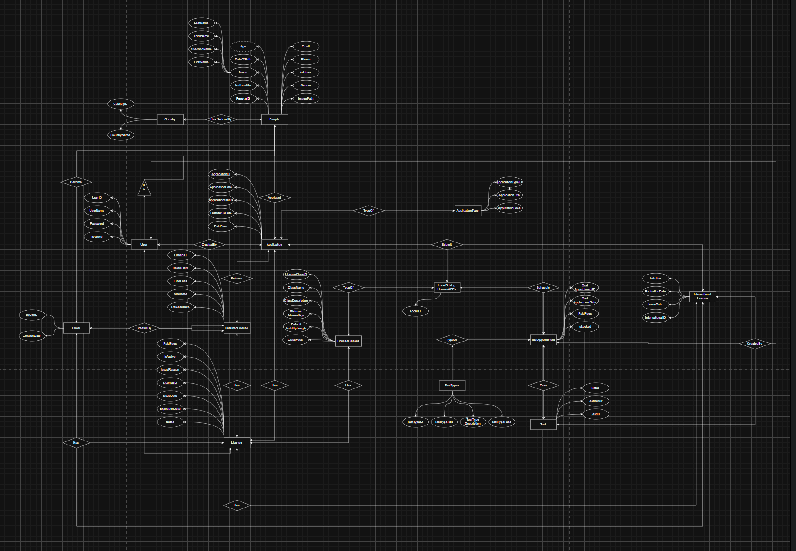
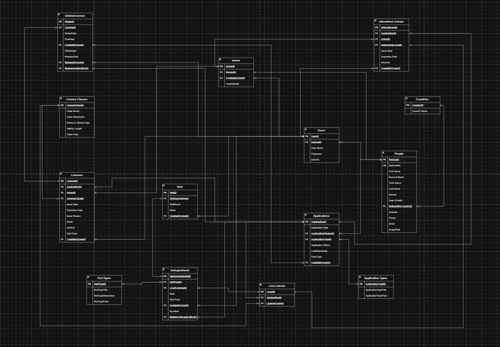
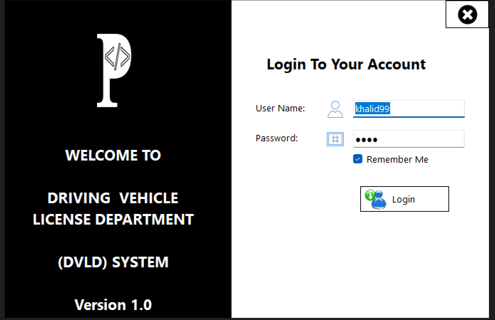
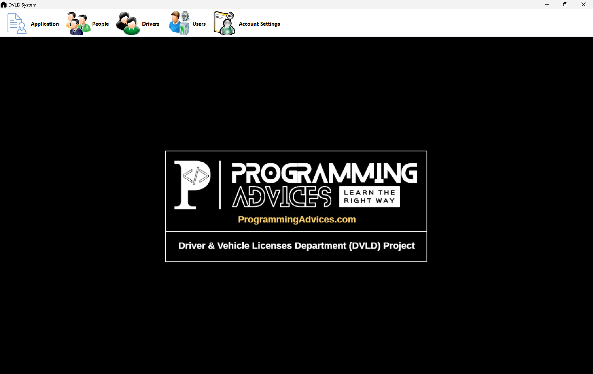
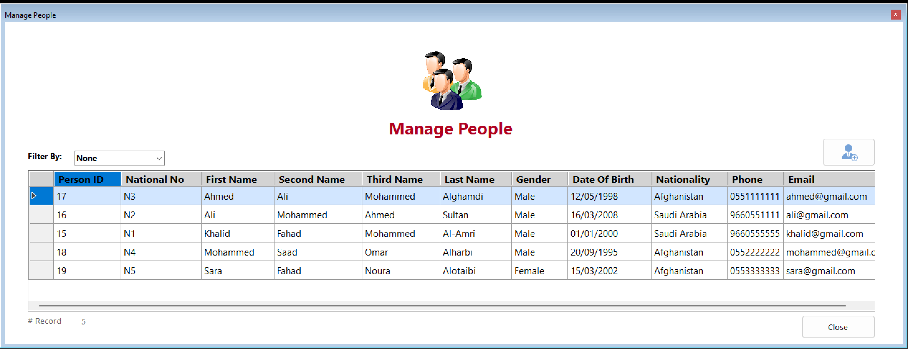
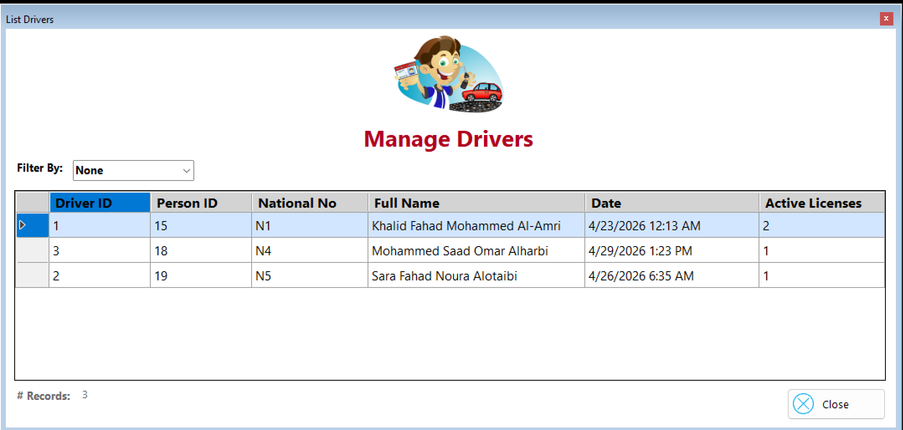
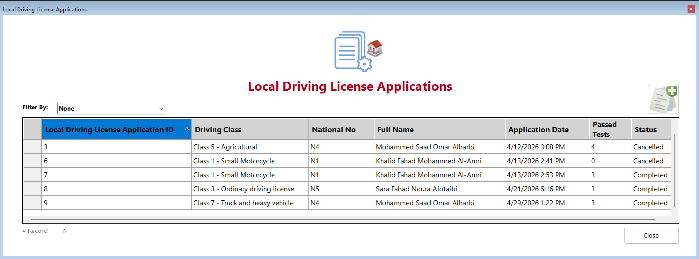
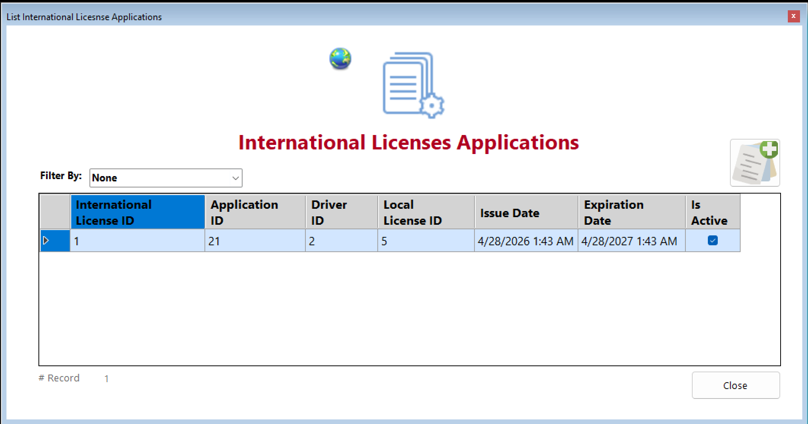

# DVLD Management System

A complete Driving & Vehicle License Department (DVLD) Management System developed using C#, Windows Forms, SQL Server, ADO.NET, and 3-Tier Architecture.

---

## Overview

DVLD Management System is a desktop application that automates the process of managing driving licenses and related services.

The system supports license issuance, renewals, replacements, testing procedures, international licenses, driver management, and user administration through a structured and scalable architecture.

---

## Key Features

### License Services

* Issue a driving license for the first time.
* Renew expired licenses.
* Replace lost licenses.
* Replace damaged licenses.
* Release detained licenses.
* Issue international driving licenses.
* Re-take failed tests.

### Testing Management

* Vision Test
* Written Test
* Practical Driving Test

### People & Drivers Management

* Add, update, and delete people records.
* Search using National Number.
* Manage drivers and license history.

### User Management

* Add, update, and deactivate users.
* Manage system access.
* Secure authentication system.

### Security & Reliability

* SHA-256 Password Hashing.
* Windows Registry support for saving login credentials.
* Windows Event Log integration for exception handling and diagnostics.

---

## Technologies Used

* C#
* .NET Framework
* Windows Forms (WinForms)
* SQL Server
* ADO.NET
* 3-Tier Architecture
* User Controls
* SHA-256 Password Hashing
* Windows Registry
* Windows Event Log
* Git & GitHub

---

## Architecture

The application follows the 3-Tier Architecture pattern:

### Presentation Layer

Responsible for user interaction and UI.

### Business Layer

Contains business rules, validations, and application logic.

### Data Access Layer

Handles communication with SQL Server through ADO.NET.

---

## Project Structure

```text
DVLD
│
├── DVLD
├── DVLD_Business
├── DVLD_DataAccess
├── DVLD.Common
│
├── Database
│   └── DVLD_Schema.sql
│
├── Database-Design
│   ├── DVLD_ERD.png
│   ├── DVLD_RS.png
│   └── Requirements.pdf
│
└── Screenshots
```

---

## Database Design

### Entity Relationship Diagram (ERD)



### Relational Schema



---

## Application Screenshots

### Login



### Dashboard



### People Management



### Driver Management



### Local License Applications



### International License Applications



---

## Database Setup

1. Open SQL Server.
2. Create a database named **DVLD**.
3. Execute:

```sql
Database/DVLD_Schema.sql
```

4. Update the connection string.
5. Run the application.

---

## Demo Video

🚧 Coming Soon...

A full walkthrough and demonstration video will be added later.

---

## Learning Outcomes

This project helped strengthen practical experience in:

* Object-Oriented Programming (OOP)
* Database Design
* SQL Server Development
* ADO.NET
* Layered Architecture
* Authentication & Security
* Exception Handling
* Source Control with Git & GitHub

---

## Author

GitHub:
https://github.com/KhalidSyntax

LinkedIn:
https://www.linkedin.com/in/khalidamri/
